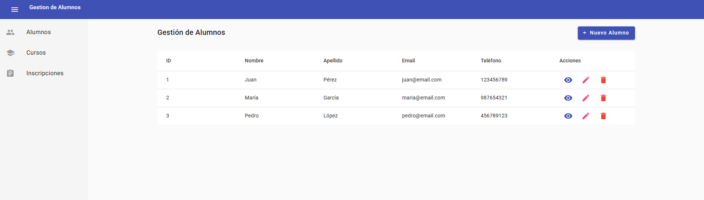

# Gestion Alumnos En Angular

# 🏫 Sistema de Gestión Educativa - Angular

## 📌 Descripción
Aplicación web para administrar alumnos, cursos y sus inscripciones, desarrollada con Angular y Angular Material.

## ✨ Características
- **Alumnos**:
  - Registro con datos personales
  - Historial académico
  - CRUD completo

- **Cursos**:
  - Catálogo de materias
  - Detalles de cada curso
  - Gestión de profesores

- **Inscripciones**:
  - Matrícula de alumnos
  - Asignación a cursos
  - Registro de fechas

## 🛠 Tecnologías
| Componente       | Tecnología          |
|------------------|---------------------|
| Frontend         | Angular 16+         |
| UI               | Angular Material    |
| Estado           | RxJS                |
| Estructura       | Arquitectura modular|

## 📂 Estructura de archivos

app/
├── core/ # Servicios y modelos
├── features/ # Módulos principales
├── shared/ # Componentes/pipes comunes
├── assets/ # Recursos estáticos
└── environments/ # Configuraciones

## 🚀 Instalación
1. Clonar repositorio:

git clone https://github.com/tu-usuario/tu-repo.git
cd tu-repo

Instalar dependencias:

npm install
Iniciar servidor:

ng serve
Abrir en navegador:

text
http://localhost:4200
📊 Datos Iniciales
La aplicación incluye:

5 alumnos de ejemplo

3 cursos pre-cargados

Inscripciones demostrativas
----------------------------------------------------
# 🏫 Sistema de Gestión Educativa - Angular

## 📸 Capturas de Pantalla

  <h3>Vista de Alumnos</h3>
  
  
  <h3>Vista de Cursos</h3>
  
  
  <h3>Vista de Inscripciones</h3>
  

  <h3>Ingresar Alumno</h3>
  

  <h3>Ingresar Curso</h3>
  

  <h3>Ingresar Inscripciones</h3>
  

